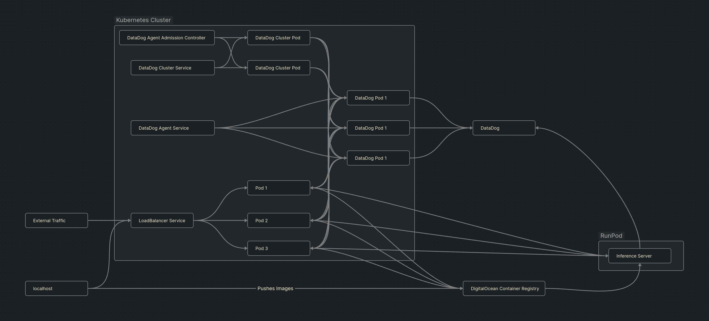

# What is this?



This is demo code that shows off a working kubernetes proxy that forwards image classification requests onto a GPU inference server. Both the cluster and inference server submit logs to datadog. Everything (except for making requests) only requires docker, CUDA, and up to date nvidia drivers installed on the host machine.

At a high level, this repo contains:

1. A way to download and cache models and datasets straight from huggingface
1. A way to expose those cached models via a FastAPI server endpoint
1. A docker configuration that exposes a `debugpy` port so that you can debug your running application while its running inside of a docker container
1. A way to run tests
1. A way to debug tests (using `debugpy` as mentioned above)
1. A way to run pre-commits on your code from within docker
1. A way to manually run pre-commits on all code in your repository. Code quality matters!
1. Full Observability with DataDog
1. GPU health monitoring

# Local Development

Create a `.env` file with `DD_API_KEY=none` in it.

`make setup` runs a download script in a docker container that caches the image classification model and its associated dataset. This must be run before running the application or tests.

`make run-inference` runs the application, `make run-inference-debug` runs the application with an open debugger port. Likewise with `make run-inference-test` and `make run-inference-test-debug`. `make test-cicd` is the exact same as `make test` except it does not run with GPU support. This is simply due to the fact that default runners for GitHub Actions do not use GPUs and it takes some amount of effort and special permissions to get them.

`make run-proxy`

`make clean` cleans up unused docker images.

`make precommit` runs pre-commit on staged files and `make precommit-all` runs pre-commit on all files in your repository.

# Making Requests

There are several different targets set up for making inference requests. The basic command is:

```
python api_call.py --mode proxy --num_images 1
```

The mode can be one of `local,proxy,direct` where local sends a request to a container running on your machine, proxy sends it to the kubernetes cluster, and direct sends it straight to the runpod instance. The API accepts any number of images, though the total number would physically be limited by the VRAM of the GPU.

This is the _only_ case where you are required to have a virtual environment. This was set up with Python 3.11 if you run into any issues with other versions. Setup:

```
python -m venv venv && source venv/bin/activate
```

Then install a couple libraries:

```
pip install matplotlib==3.9.1
pip install requests==2.32.3
pip install datasets==2.20.0
```

# Setup and helpful information

## Install

Install `docker`: https://docs.docker.com/engine/install/

Optionally install CUDA container toolkit to allow the container ot access the GPU and increase inference speed: https://docs.nvidia.com/datacenter/cloud-native/container-toolkit/latest/install-guide.html

You may also need to install `make`: `sudo apt-get install make`

## Pre-commit

Add the following to your `.git/hooks/pre-commit` file:

```
#!/bin/sh

# Run the precommit target using make
make precommit

if [ $? -ne 0 ]; then
  echo "Pre-commit hook failed. Aborting commit."
  exit 1
fi

# Allow the commit to proceed
exit 0
```

Then make it executable with `chmod +x .git/hooks/pre-commit`. This will run pre-commit on your staged files within a dockerfile.

## Deployment

All images are pushed to DigitalOcean Container Registry.

```
./deploy_inference.sh
```

This builds and pushes the inference image to the container registry. The next time the inference server is restarted, it detects that there was an update to the container image and pulls a new one.

```
./deploy_proxy.sh
```

This builds and pushes the proxy image to the container registry. Then it applies the deployment manifest, restarts the deployment to pull the new image, and follows along with the status of the deployment so we can watch to see of the rollout was successful.

# Debug Configurations

I use neovim with `nvim-dap`, so these instructions are meant for that but there is no reason why you can't have your own setup for VS Code or some other editor. If you need help starting it up using something other than Neovim, ask your friendly local AI for help (maybe even using this repo!) and make a PR when you get it working.

First I set up an adapter to connect to the open debugpy port on localhost:

```
      dap.adapters.python = {
        type = 'server',
        host = 'localhost',
        port = 5678, -- This should match the port that debugpy is listening on in Docker
      }
```

Then I set up a python configuration:

```
      dap.configurations.python = {
        {
          -- Connect to the Python process in Docker
          type = 'python',
          request = 'attach',
          name = 'Dockerfile - /workspace',
          pathMappings = {
            {
              localRoot = vim.fn.getcwd(), -- The directory of your project on your local filesystem
              remoteRoot = '/workspace', -- The directory in Docker where your project is mounted
            },
          },
        },
```
